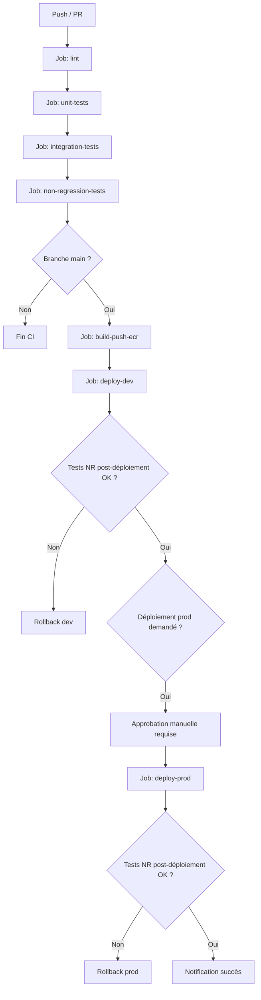
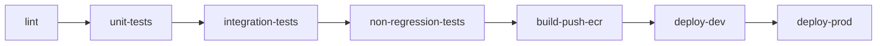
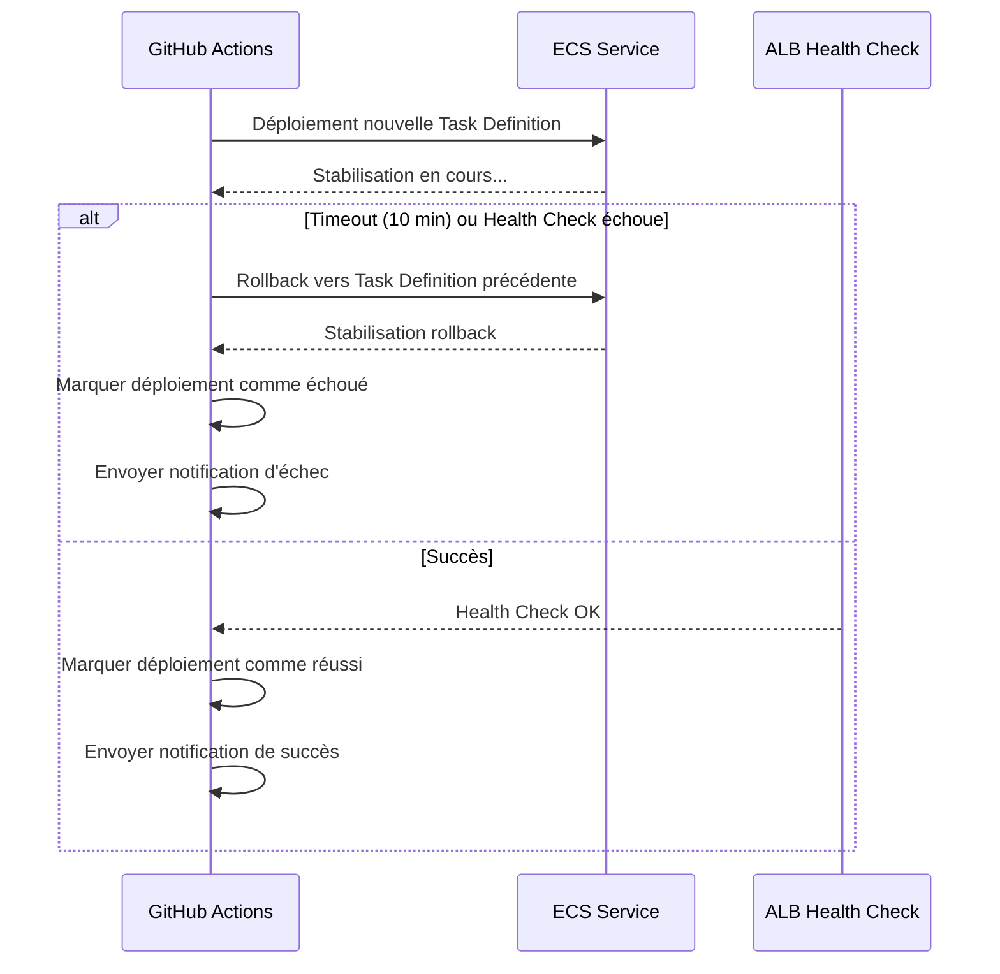

# Document de Design Technique — Pipeline CI/CD ClubManager

## Vue d'ensemble

Ce document décrit l'architecture technique du pipeline CI/CD pour l'application ClubManager (Club Manager v3.1.4). Le pipeline remplace le déploiement manuel par `rsync` (`scripts/deploy.sh`) et automatise l'intégration continue, les tests et le déploiement continu vers AWS.

### Objectifs

- Automatiser la validation du code (lint, tests unitaires, tests d'intégration, tests de non-régression) à chaque modification
- Construire et publier une image Docker versionnée dans Amazon ECR
- Déployer automatiquement vers ECS Fargate avec stratégie zéro-downtime
- Gérer deux environnements (`dev` en automatique, `prod` avec approbation manuelle)
- Garantir qu'aucun secret n'est exposé dans le code ou les logs

### Contraintes techniques

- Application : Node.js 22 / Express 5, base de données MySQL 8.0 (RDS)
- Infrastructure AWS existante : ECS Fargate, ECR, RDS, ALB, VPC (Terraform dans `infra/`)
- Outil CI/CD : GitHub Actions
- Authentification AWS : OIDC (sans credentials de longue durée)
- Tests : Jest (unitaires), Supertest + service container PostgreSQL (intégration)

---

## Architecture

### Vue globale du pipeline



### Structure des workflows GitHub Actions

Deux fichiers de workflow sont définis dans `.github/workflows/` :

| Fichier | Déclencheur | Rôle |
|---------|-------------|------|
| `ci.yml` | `push` (toutes branches), `pull_request` vers `main` | Lint, tests unitaires, tests d'intégration, tests de non-régression |
| `cd.yml` | `push` sur `main` (après merge PR) | Build Docker, push ECR, déploiement ECS dev/prod |

### Séquence des jobs et dépendances



Chaque job déclare `needs: [job-précédent]` pour garantir l'ordre séquentiel. Un échec interrompt la chaîne via le comportement par défaut de GitHub Actions.

---

## Composants et Interfaces

### 1. Workflow CI (`ci.yml`)

**Déclencheurs :**
```yaml
on:
  push:
    branches: ['**']
  pull_request:
    branches: [main]
```

**Jobs :**

#### Job `lint`
- Checkout du code
- Installation des dépendances (`npm ci`)
- Exécution d'ESLint avec `eslint-plugin-security`
- Audit des dépendances (`npm audit --audit-level=critical`)
- Détection de secrets (`detect-secrets` ou `truffleHog`)

#### Job `unit-tests`
- Dépend de : `lint`
- Exécution de Jest avec `--coverage`
- Upload du rapport de couverture comme artifact (30 jours)
- Upload du rapport JUnit XML comme artifact (30 jours)

#### Job `integration-tests`
- Dépend de : `unit-tests`
- Service container PostgreSQL (image `postgres:15`)
- Application des migrations de schéma et seed
- Exécution des tests Supertest
- Upload du rapport JUnit XML comme artifact (30 jours)

#### Job `non-regression-tests`
- Dépend de : `integration-tests`
- Exécution des tests de workflow end-to-end
- Timeout : 10 minutes
- Upload du rapport JUnit XML comme artifact (30 jours)

### 2. Workflow CD (`cd.yml`)

**Déclencheur :**
```yaml
on:
  push:
    branches: [main]
```

**Jobs :**

#### Job `build-push-ecr`
- Dépend de : succès du workflow CI (via `workflow_run` ou jobs enchaînés)
- Authentification AWS via OIDC (`aws-actions/configure-aws-credentials`)
- Login ECR (`aws-actions/amazon-ecr-login`)
- Build Docker multi-stage
- Tag : `{SHA_COURT}` + `latest`
- Push vers ECR `nodejs-app-{environment}`
- Vérification du scan ECR (warning si vulnérabilités critiques)

#### Job `deploy-dev`
- Dépend de : `build-push-ecr`
- Environnement GitHub : `dev`
- Mise à jour de la Task Definition ECS avec le nouvel URI d'image
- Déploiement rolling update sur `nodejs-app-dev-service`
- Attente de stabilisation (`wait-for-service-stability: true`, timeout 10 min)
- Health check ALB
- Rollback automatique en cas d'échec
- Tests de non-régression post-déploiement contre l'URL ALB

#### Job `deploy-prod`
- Dépend de : `deploy-dev` (succès complet incluant tests NR)
- Environnement GitHub : `prod` (approbation manuelle requise)
- Mêmes étapes que `deploy-dev` avec les ressources prod
- Tests de non-régression complets post-déploiement

### 3. Configuration ESLint

Fichier `.eslintrc.js` à créer :

```javascript
module.exports = {
  env: { node: true, es2022: true },
  extends: ['eslint:recommended', 'plugin:security/recommended'],
  plugins: ['security'],
  rules: {
    'security/detect-sql-injection': 'error',
    'security/detect-eval-with-expression': 'error',
    'security/detect-non-literal-regexp': 'warn',
    'no-eval': 'error',
  }
};
```

### 4. Configuration Jest

Fichier `jest.config.js` à créer :

```javascript
module.exports = {
  testEnvironment: 'node',
  collectCoverage: true,
  coverageDirectory: 'coverage',
  coverageThreshold: {
    global: { lines: 70, functions: 70, branches: 70, statements: 70 }
  },
  reporters: ['default', ['jest-junit', { outputDirectory: 'reports', outputName: 'junit.xml' }]],
  testMatch: ['**/__tests__/**/*.test.js'],
  setupFilesAfterFramework: ['./tests/setup.js']
};
```

### 5. Rôle IAM OIDC pour GitHub Actions

Un rôle IAM dédié au pipeline doit être créé dans Terraform (`infra/iam_github_actions.tf`) :

```hcl
# Provider OIDC GitHub
resource "aws_iam_openid_connect_provider" "github" {
  url             = "https://token.actions.githubusercontent.com"
  client_id_list  = ["sts.amazonaws.com"]
  thumbprint_list = ["6938fd4d98bab03faadb97b34396831e3780aea1"]
}

# Rôle assumable par GitHub Actions via OIDC
resource "aws_iam_role" "github_actions" {
  name = "${var.project_name}-github-actions-role"
  assume_role_policy = jsonencode({
    Version = "2012-10-17"
    Statement = [{
      Effect    = "Allow"
      Principal = { Federated = aws_iam_openid_connect_provider.github.arn }
      Action    = "sts:AssumeRoleWithWebIdentity"
      Condition = {
        StringEquals = {
          "token.actions.githubusercontent.com:aud" = "sts.amazonaws.com"
        }
        StringLike = {
          "token.actions.githubusercontent.com:sub" = "repo:{ORG}/{REPO}:*"
        }
      }
    }]
  })
}
```

Permissions du rôle : ECR (push/pull), ECS (update-service, register-task-definition, describe-services), IAM PassRole (limité aux rôles ECS), CloudWatch Logs (put-log-events).

---

## Modèles de Données

### Variables GitHub Actions par environnement

| Variable | Environnement `dev` | Environnement `prod` |
|----------|---------------------|----------------------|
| `ECR_REPOSITORY` | `nodejs-app-dev` | `nodejs-app-prod` |
| `ECS_CLUSTER` | `nodejs-app-dev-cluster` | `nodejs-app-prod-cluster` |
| `ECS_SERVICE` | `nodejs-app-dev-service` | `nodejs-app-prod-service` |
| `ECS_TASK_DEFINITION` | `nodejs-app-dev` | `nodejs-app-prod` |
| `ALB_URL` | URL ALB dev | URL ALB prod |
| `AWS_REGION` | `us-east-1` | `us-east-1` |

### Secrets GitHub Actions (niveau dépôt)

| Secret | Description |
|--------|-------------|
| `AWS_ROLE_ARN` | ARN du rôle IAM OIDC GitHub Actions |
| `TEST_DB_PASSWORD` | Mot de passe PostgreSQL pour les tests d'intégration |

### Structure des artifacts produits

| Artifact | Contenu | Rétention |
|----------|---------|-----------|
| `coverage-report` | Rapport HTML de couverture Jest | 30 jours |
| `unit-test-results` | JUnit XML tests unitaires | 30 jours |
| `integration-test-results` | JUnit XML tests d'intégration | 30 jours |
| `non-regression-results` | JUnit XML tests de non-régression | 30 jours |

### Modèle de tag d'image Docker

```
{AWS_ACCOUNT_ID}.dkr.ecr.{REGION}.amazonaws.com/nodejs-app-{env}:{SHA_COURT}
{AWS_ACCOUNT_ID}.dkr.ecr.{REGION}.amazonaws.com/nodejs-app-{env}:latest
```

Où `SHA_COURT` = 7 premiers caractères du SHA du commit Git (`${{ github.sha }}` tronqué).

### Structure des tests

```
tests/
├── unit/
│   ├── MemberService.test.js
│   ├── PaymentService.test.js
│   ├── TeamService.test.js
│   ├── EventService.test.js
│   ├── FacilityService.test.js
│   └── ReportService.test.js
├── integration/
│   ├── auth.test.js
│   ├── members.test.js
│   ├── payments.test.js
│   └── security.test.js
├── non-regression/
│   ├── member-lifecycle.test.js
│   ├── payment-workflow.test.js
│   └── event-booking.test.js
└── setup.js
```

---

## Propriétés de Correction

*Une propriété est une caractéristique ou un comportement qui doit être vrai pour toutes les exécutions valides d'un système — essentiellement, un énoncé formel de ce que le système doit faire. Les propriétés servent de pont entre les spécifications lisibles par l'humain et les garanties de correction vérifiables par machine.*

### Propriété 1 : Filtrage des membres

*Pour tout* ensemble de membres en base de données et tout filtre `{status, sport}` valide, `getAllMembers(filtre)` doit retourner uniquement les membres dont les attributs correspondent exactement au filtre appliqué — aucun membre non correspondant ne doit apparaître dans les résultats.

**Valide : Exigences 3.7**

---

### Propriété 2 : Expiration d'adhésion

*Pour toute* date de renouvellement passée (antérieure à `Date.now()`), `isMembershipExpired` doit retourner `true` ; pour toute date future (postérieure à `Date.now()`), elle doit retourner `false`.

**Valide : Exigences 3.7**

---

### Propriété 3 : Paiements en retard

*Pour tout* ensemble de paiements avec des statuts et des dates d'échéance variés, `getOverduePayments()` doit retourner uniquement les paiements dont le statut est `pending` ET dont la date d'échéance est strictement antérieure à la date courante — aucun paiement payé ou dont l'échéance est future ne doit apparaître.

**Valide : Exigences 3.8**

---

### Propriété 4 : Résultat de match

*Pour tout* couple d'entiers non-négatifs `(score_domicile, score_visiteur)`, `recordMatchResult` doit retourner :
- `'win'` si `score_domicile > score_visiteur`
- `'loss'` si `score_domicile < score_visiteur`
- `'draw'` si `score_domicile === score_visiteur`

**Valide : Exigences 3.9**

---

### Propriété 5 : Disponibilité d'installation

*Pour toute* paire de plages horaires `(début1, fin1)` et `(début2, fin2)` pour la même installation, `checkFacilityAvailability` doit retourner `false` si les plages se chevauchent (i.e., `début1 < fin2 && début2 < fin1`), et `true` dans le cas contraire.

**Valide : Exigences 3.10**

---

### Propriété 6 : Prévention des injections SQL

*Pour tout* paramètre d'entrée contenant un pattern d'injection SQL classique (`' OR 1=1 --`, `'; DROP TABLE`, `UNION SELECT`, etc.), toute route de l'application doit : (a) refuser l'accès non autorisé, et (b) laisser les données de la base de données intactes après la requête.

**Valide : Exigences 4.4, 4.7**

---

### Propriété 7 : Contrôle d'accès par rôle

*Pour tout* utilisateur authentifié avec un rôle `member` (non-admin), toute tentative d'accès à une route protégée par `requireAdmin` doit retourner un statut HTTP 403, indépendamment de la route ciblée ou des paramètres de la requête.

**Valide : Exigences 4.5**

---

### Propriété 8 : Validation des données à la création

*Pour tout* objet de création de membre avec au moins un champ obligatoire manquant ou invalide (email malformé, montant négatif pour un paiement), l'opération de création doit retourner une erreur de validation et ne doit pas insérer d'enregistrement en base de données.

**Valide : Exigences 4.8**

---

### Propriété 9 : Tagging d'image Docker

*Pour tout* SHA de commit Git de 40 caractères hexadécimaux, la logique de génération du tag d'image doit produire exactement les 7 premiers caractères du SHA, sans troncature supplémentaire ni caractères parasites.

**Valide : Exigences 6.2**

---

### Propriété 10 : Détection de secrets dans le code source

*Pour tout* fichier source contenant un pattern de secret connu (clé AWS commençant par `AKIA`, mot de passe en dur dans une chaîne de connexion, token d'API), l'outil de détection de secrets doit retourner au moins une alerte bloquante.

**Valide : Exigences 8.3**

---

### Propriété 11 : Règles ESLint de sécurité

*Pour tout* fichier JavaScript contenant un pattern dangereux connu (`eval()` avec expression dynamique, concaténation directe dans une requête SQL), ESLint configuré avec `eslint-plugin-security` doit retourner au moins une erreur bloquante (exit code non-zéro).

**Valide : Exigences 2.3**

---

## Gestion des Erreurs

### Stratégie de rollback

En cas d'échec du déploiement (timeout de stabilisation ECS ou échec du health check ALB), le pipeline exécute automatiquement un rollback :



**Mécanisme de rollback ECS :**
1. Récupérer l'ARN de la Task Definition précédente (avant le déploiement)
2. Appeler `aws ecs update-service --task-definition {ARN_PRÉCÉDENT}`
3. Attendre la stabilisation du service
4. Logger l'événement de rollback dans CloudWatch

### Gestion des erreurs par stage

| Stage | Type d'erreur | Comportement |
|-------|---------------|--------------|
| `lint` | Erreur ESLint bloquante | Échec immédiat, pipeline interrompu |
| `lint` | Vulnérabilité npm critique | Échec immédiat, pipeline interrompu |
| `lint` | Secret détecté | Échec immédiat, pipeline interrompu |
| `unit-tests` | Test échoué | Échec avec affichage nom/message/stack trace |
| `unit-tests` | Coverage < 70% | Avertissement, pipeline continue |
| `integration-tests` | Test échoué | Échec, pipeline interrompu |
| `build-push-ecr` | Build Docker échoué | Échec avec logs complets |
| `build-push-ecr` | Vulnérabilité ECR critique | Avertissement, déploiement continue |
| `deploy-dev/prod` | Timeout stabilisation ECS | Rollback automatique + notification |
| `deploy-dev/prod` | Health check ALB échoué | Rollback automatique + notification |

### Notifications

Les notifications sont envoyées via les mécanismes natifs de GitHub Actions (statut de commit, annotations PR) et optionnellement via un webhook Slack/email :

- **Échec sur `main`** : Nom du stage échoué + lien vers les logs + SHA du commit
- **Succès de déploiement** : Version déployée (SHA) + URL ALB + environnement cible

---

## Stratégie de Tests

### Approche duale

La stratégie combine des tests par exemple (cas concrets) et des tests basés sur les propriétés (couverture universelle) :

| Type | Outil | Portée | Quand |
|------|-------|--------|-------|
| Tests unitaires (exemple) | Jest + jest.mock() | Services métier isolés | Chaque push |
| Tests unitaires (propriété) | Jest + fast-check | Fonctions pures des services | Chaque push |
| Tests d'intégration | Supertest + PostgreSQL | Routes Express + BDD | Chaque push |
| Tests de non-régression | Supertest | Workflows end-to-end | Chaque push + post-déploiement |

### Tests basés sur les propriétés (Property-Based Testing)

La bibliothèque choisie est **fast-check** (npm), adaptée à l'écosystème Node.js/Jest.

```bash
npm install --save-dev fast-check
```

Chaque test de propriété est configuré pour un minimum de **100 itérations** et est annoté avec un commentaire de traçabilité :

```javascript
// Feature: cicd-pipeline, Property 4: recordMatchResult retourne le bon résultat pour tout couple de scores
test('recordMatchResult - résultat correct pour tout couple de scores', () => {
  fc.assert(
    fc.property(
      fc.nat(), fc.nat(),
      (scoreHome, scoreAway) => {
        const result = EventService.computeMatchResult(scoreHome, scoreAway);
        if (scoreHome > scoreAway) return result === 'win';
        if (scoreHome < scoreAway) return result === 'loss';
        return result === 'draw';
      }
    ),
    { numRuns: 100 }
  );
});
```

### Configuration du service container PostgreSQL (tests d'intégration)

```yaml
services:
  postgres:
    image: postgres:15
    env:
      POSTGRES_DB: clubmanager_test
      POSTGRES_USER: test_user
      POSTGRES_PASSWORD: ${{ secrets.TEST_DB_PASSWORD }}
    ports:
      - 5432:5432
    options: >-
      --health-cmd pg_isready
      --health-interval 10s
      --health-timeout 5s
      --health-retries 5
```

### Isolation des tests unitaires

Tous les tests unitaires utilisent `jest.mock('./database')` pour isoler les services de la base de données réelle. Les tests doivent passer sans aucune variable d'environnement de base de données configurée.

### Tests de non-régression post-déploiement

Les tests de non-régression s'exécutent en deux contextes :
1. **Pré-déploiement** (CI) : contre un environnement de test local avec service container
2. **Post-déploiement** (CD) : contre l'URL ALB de l'environnement déployé

```javascript
// La base URL est injectée via variable d'environnement
const BASE_URL = process.env.ALB_URL || 'http://localhost:3000';
```

### Couverture de code cible

| Module | Couverture cible |
|--------|-----------------|
| `services/MemberService.js` | ≥ 80% |
| `services/PaymentService.js` | ≥ 80% |
| `services/EventService.js` | ≥ 80% |
| `services/FacilityService.js` | ≥ 80% |
| `services/ClubService.js` | ≥ 70% |
| Global | ≥ 70% (avertissement si inférieur) |

### Décisions de design notables

1. **PostgreSQL pour les tests d'intégration** : Bien que l'application utilise MySQL en production, PostgreSQL est utilisé pour les tests d'intégration via service container GitHub Actions car il est plus léger et mieux supporté dans cet environnement. Les requêtes SQL paramétrées sont compatibles entre les deux moteurs pour les cas testés.

2. **OIDC sans credentials de longue durée** : Le choix d'OIDC élimine la rotation manuelle des clés AWS et réduit la surface d'attaque. Le rôle IAM est limité aux permissions strictement nécessaires au pipeline.

3. **Deux workflows séparés (CI/CD)** : La séparation en `ci.yml` et `cd.yml` permet d'exécuter la CI sur toutes les branches sans déclencher de déploiement, et de déclencher le CD uniquement sur `main`.

4. **fast-check pour le PBT** : Choisi pour son intégration native avec Jest, sa documentation en français disponible et sa maturité dans l'écosystème Node.js.
